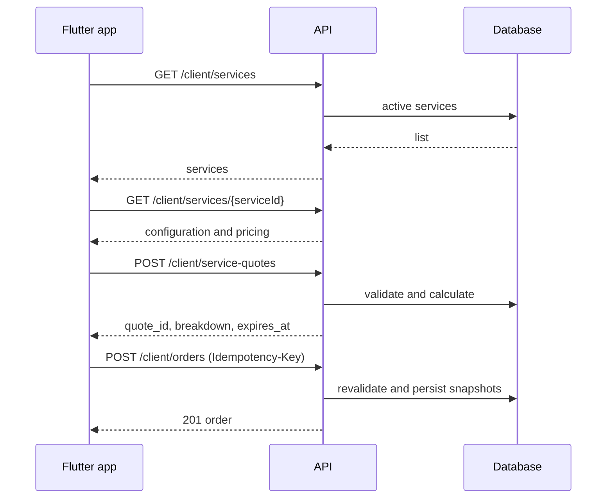
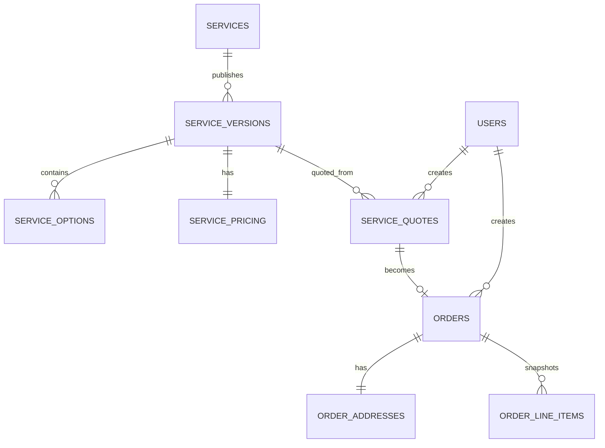

# API: главная страница, каталог услуг и оформление заказа

## Статус и цель

Документ составлен по Flutter-фичам `/home` и `/services` (14 июля 2026). Он задаёт контракт, модель данных, правила расчёта и backlog для потока: открыть главную → выбрать услугу → настроить уборку → увидеть цену → оформить заказ.

Базовый URL: `/api/v1`. Для всех endpoint'ов требуется `Authorization: Bearer <token>` пользователя с ролью `client`. JSON в UTF-8, имена полей — `snake_case`; деньги передаются числом в рублях, даты — ISO 8601 с часовым поясом.

## Фактическое состояние клиента

| Область           | Нужные данные                                                   | Состояние                                                                 |
| ----------------- | --------------------------------------------------------------- | ------------------------------------------------------------------------- |
| Главная / каталог | название, подзаголовок, число клинеров, длительность, цена «от» | `ServicesController` вызывает repository, но datasource полностью моковый |
| Детали услуги     | описание, медиа, площадь, варианты и modifiers                  | вызов detail есть, но данные моковые                                      |
| Конфигуратор      | комнаты / основной тип уборки / дополнительные работы           | цена предварительно считается на устройстве                               |
| Оформление        | адрес, дата, время, состав услуги, цена                         | успех имитируется через `Future.delayed`; HTTP POST отсутствует           |
| Шапка home        | количество и статус активных уборок                             | «1 уборка / В процессе» захардкожено                                      |

У клиента реально используются услуги `standard`, `premium`, `cottage`. В другом mock-списке ещё есть `express`, `office`, `kids`, поэтому состав и названия каталога требуют продуктового решения до наполнения production.

## Границы v1

Backend v1 обязан поддержать:

1. Список и детали доступных услуг.
2. Серверный расчёт цены по конфигурации.
3. Создание заказа с валидацией, снимком тарифа и идемпотентностью.
4. Сводку активных заказов для шапки главной.

Подбор клинера, отмена, эквайринг и админ-интерфейс не входят в v1, но структура заказа должна позволять добавить их без миграции существующих заказов.

## Поток



Клиент может показывать локальную предварительную цену, но источник истины — quote, а при заказе сервер пересчитывает сумму повторно. Никогда не доверять цене, option IDs или площади из тела заказа без серверной проверки.

## Endpoint'ы

### Сводка главной

`GET /api/v1/client/home-summary`

```json
{
  "data": {
    "active_orders_count": 1,
    "active_order_status": "in_progress",
    "active_order_status_label": "В процессе"
  }
}
```

Если активных уборок нет: count = 0, status и label = `null`. В счётчик входят `new`, `awaiting_cleaner`, `assigned`, `in_progress`; при нескольких заказах статус относится к ближайшему по `scheduled_at`.

### Каталог услуг

`GET /api/v1/client/services`

Опциональный query-параметр `city_id` зарезервирован для появления географии. В v1 список не пагинируется; возвращаются только активные услуги в `sort_order`.

```json
{
  "data": [
    {
      "id": "standard",
      "slug": "standard",
      "title": "Базовый минимум",
      "subtitle": "Расширенная поддерживающая уборка",
      "short_description": "Оптимальный выбор для регулярного поддержания чистоты.",
      "cleaners_label": "1 клинер",
      "duration_label": "2–3 часа",
      "price_from": 7700,
      "image_url": "https://cdn.example.com/services/standard/card.jpg",
      "gallery": [],
      "created_at": "2026-07-01T10:00:00+00:00",
      "updated_at": "2026-07-14T10:00:00+00:00"
    }
  ]
}
```

Для текущего Flutter-клиента непустые `id`, `title`, `cleaners_label`, `duration_label` обязательны. Остальные поля могут быть null/пустыми. `id` — стабильный строковый slug: он используется в URL и конфигурации заказа, поэтому не отдавать вместо него изменяемый числовой PK.

### Детали услуги

`GET /api/v1/client/services/{serviceId}`

Недоступная либо выключенная услуга возвращает `404 service_not_found`. Массивы всегда передавать как `[]`, а не null.

```json
{
  "data": {
    "id": "standard",
    "slug": "standard",
    "title": "Базовый минимум",
    "subtitle": "Расширенная поддерживающая уборка",
    "short_description": "Оптимальный выбор для регулярного поддержания чистоты.",
    "description": "Описание состава и ограничений уборки.",
    "cleaners_label": "1 клинер",
    "duration_label": "2–3 часа",
    "price_from": 7700,
    "image_url": "https://cdn.example.com/services/standard/hero.jpg",
    "gallery": ["https://cdn.example.com/services/standard/1.jpg"],
    "pricing": {
      "base_price": 7700,
      "price_per_sqm": 0,
      "min_area": 30,
      "max_area": 160,
      "area_step": 10,
      "min_price": 7700,
      "currency": "RUB"
    },
    "room_options": [
      {
        "id": "room-1",
        "title": "1-комнатная",
        "subtitle": "30–50 м²",
        "is_addon": false,
        "default": true,
        "price_modifier": 0,
        "sort_order": 10
      }
    ],
    "cleaning_options": [
      {
        "id": "support",
        "title": "Поддерживающая",
        "subtitle": null,
        "is_addon": false,
        "default": true,
        "price_modifier": 0,
        "sort_order": 10
      }
    ],
    "extra_options": [
      {
        "id": "fridge-inside",
        "title": "Холодильник внутри (освобождённый и размороженный)",
        "subtitle": null,
        "is_addon": true,
        "default": false,
        "price_modifier": 800,
        "sort_order": 10
      }
    ],
    "created_at": "2026-07-01T10:00:00+00:00",
    "updated_at": "2026-07-14T10:00:00+00:00"
  }
}
```

Значение массивов:

- `room_options` — один взаимоисключающий выбор.
- `cleaning_options` — один основной вариант (`is_addon: false`) и, при необходимости, допы.
- `extra_options` — только допы.

У option ID уникальны внутри услуги. У обязательной группы основных вариантов допускается ровно один `default: true`. Порядок в массиве — отображаемый до подключения Flutter к `sort_order`.

Текущий mapper читает перечисленные поля кроме `pricing.area_step` и `sort_order`: пока приложение использует local preset. Их необходимо подключить отдельной frontend-задачей.

### Предварительный расчёт

`POST /api/v1/client/service-quotes`

Quote действует 15 минут и принадлежит создавшему его пользователю. Вызывать при переходе на checkout и после изменения параметров с debounce.

```json
{
  "service_id": "standard",
  "area_sqm": 64,
  "room_option_id": "room-2",
  "cleaning_option_id": "support",
  "extra_option_ids": ["fridge-inside", "windows-room-2"]
}
```

```json
{
  "data": {
    "quote_id": "01J2QK9B4B5W5M8T6CQZBW3R7P",
    "service_id": "standard",
    "currency": "RUB",
    "area_sqm": 64,
    "line_items": [
      { "kind": "base", "title": "Базовый минимум", "amount": 7700 },
      {
        "kind": "room_option",
        "option_id": "room-2",
        "title": "2-комнатная",
        "amount": 600
      },
      {
        "kind": "extra_option",
        "option_id": "fridge-inside",
        "title": "Холодильник внутри",
        "amount": 800
      }
    ],
    "subtotal": 9100,
    "discount": 0,
    "total_price": 9100,
    "expires_at": "2026-07-14T11:15:00+00:00"
  }
}
```

При невалидной площади, отключённой/чужой опции или несовместимом наборе вернуть `422 validation_error`.

### Создание заказа

`POST /api/v1/client/orders`

Заголовки:

```text
Authorization: Bearer <token>
Idempotency-Key: <UUID v4>
```

Ключ обязателен; уникален по клиенту минимум 24 часа. Повтор с тем же телом возвращает исходный результат, с отличающимся телом — `409 idempotency_key_conflict`.

```json
{
  "quote_id": "01J2QK9B4B5W5M8T6CQZBW3R7P",
  "address": {
    "full_address": "г. Иркутск, ул. Ленина, д. 10",
    "fias_id": "a-valid-fias-id",
    "latitude": 52.286974,
    "longitude": 104.305018,
    "entrance": "1",
    "floor": "4",
    "apartment": "42",
    "intercom": "42",
    "comment": "Позвонить за 15 минут"
  },
  "scheduled_at": "2026-07-20T11:00:00+08:00",
  "payment_method": null
}
```

```json
{
  "data": {
    "id": "01J2QM1R7H7YV9JH1KACD6ZK3R",
    "status": "awaiting_cleaner",
    "status_label": "Ожидание клинера",
    "scheduled_at": "2026-07-20T11:00:00+08:00",
    "total_price": 9100,
    "currency": "RUB",
    "service": { "id": "standard", "title": "Базовый минимум" },
    "created_at": "2026-07-14T11:01:30+00:00"
  }
}
```

Сервер обязан проверить: принадлежность и срок quote, доступность сервиса, адрес из подсказки (`fias_id` либо координаты — окончательный критерий согласовать), зону обслуживания, слот, дату не ранее настоящего и не далее 365 дней. `total_price`, option IDs и service ID в create-order намеренно не передаются — используются только данные quote. Перед записью выполняется повторный расчёт в транзакции.

## Правила цены и совместимости

Текущая бизнес-формула клиента:

```text
raw = base_price + price_per_sqm × area_sqm
raw += modifier(room option)
raw += modifier(selected non-addon cleaning option)
raw += Σ modifier(selected addons)
total_price = max(raw, min_price)
```

Расчёт вести на сервере в integer minor units или Decimal, не float. В v1 итог округляется до целого рубля.

Особые связи не кодировать в Flutter строками ID. Сейчас «Помыть окна» существует как `windows-room-1 ... windows-room-4`, а UI подменяет option при смене комнаты. В БД хранить совместимость option с room option; quote с `room-1 + windows-room-2` обязан получить 422. Для будущего API допустима таблица зависимостей либо поле `constraints`; текущий мобильный контракт пока его не читает.

## Модель данных



| Таблица                       | Ключевые поля                                                               | Назначение                                                       |
| ----------------------------- | --------------------------------------------------------------------------- | ---------------------------------------------------------------- |
| `services`                    | `id`, `slug` unique, `is_active`, `sort_order`                              | Постоянная сущность каталога; slug не меняется после публикации. |
| `service_versions`            | `id`, `service_id`, status, тексты, media URLs, `published_at`              | Версия контента и правил; опубликована максимум одна.            |
| `service_pricing`             | version ID, base/area/min цены, границы и шаг площади, currency             | Правила базовой цены.                                            |
| `service_options`             | version ID, code, group, title, addon/default, modifier, order, active      | Комнаты, типы уборки и допы.                                     |
| `service_option_dependencies` | option ID, requires/allowed option ID                                       | Совместимость опций.                                             |
| `service_quotes`              | ULID, user ID, version ID, input JSON, breakdown JSON, total, expires, used | Неизменяемый server-side расчёт.                                 |
| `orders`                      | ULID, user ID, quote ID, status, schedule, total, idempotency key           | Заказ; unique `(user_id, idempotency_key)`.                      |
| `order_addresses`             | order ID, адрес, FIAS, координаты, входные поля                             | Адресный снимок.                                                 |
| `order_line_items`            | order ID, kind, source option ID, title snapshot, amount                    | Неизменяемая расшифровка цены.                                   |

Если версии услуг не войдут в первую миграцию, snapshots названия, опций, правил и цены в quotes/orders всё равно обязательны. Иначе правка тарифа исказит историю.

## Ошибки и нефункциональные требования

Единый ответ:

```json
{
  "message": "The selected configuration is invalid.",
  "code": "validation_error",
  "errors": {
    "extra_option_ids.1": ["Option windows-room-2 is incompatible with room-1."]
  }
}
```

| HTTP | Code                                                           | Случай                    |
| ---- | -------------------------------------------------------------- | ------------------------- |
| 401  | `unauthenticated`                                              | нет/истёк токен           |
| 403  | `forbidden`                                                    | не client                 |
| 404  | `service_not_found`, `quote_not_found`                         | ресурс недоступен         |
| 409  | `idempotency_key_conflict`, `quote_already_used`               | конфликт                  |
| 410  | `quote_expired`                                                | истёк или изменился тариф |
| 422  | `validation_error`, `outside_service_area`, `slot_unavailable` | нарушено правило          |
| 429  | `rate_limited`                                                 | превышен лимит            |

- Versioning только через `/api/v1`; добавление полей совместимо, удаление/переименование — новая версия.
- Для catalog/detail: ETag и Cache-Control до 5 минут. Quote и orders не кэшировать.
- Примерные лимиты: list/detail 60/мин, quote 30/мин, order 10/час на пользователя.
- Логировать request ID, user ID, service/quote/order ID и смену статуса; не писать полный адрес и комментарий в прикладные логи без необходимости.
- Интеграционные тесты: авторизация, выключенная услуга, границы площади, несовместимые options, истёкший quote, повтор одного Idempotency-Key, snapshot цены при изменении тарифа.

## Backlog

### P0 — без этого сценарий не работает

- [ ] **BE-01 Миграции каталога:** services, pricing, options, индексы; наполнить standard/premium/cottage из текущих mock-данных.
- [ ] **BE-02 Версии и snapshots:** published-версия тарифа и неизменяемый снимок в quote/order.
- [ ] **BE-03 API каталога:** реализовать два GET строго по snake_case-контракту.
- [ ] **BE-04 Pricing service:** валидировать selections/границы/зависимости и считать цену на сервере.
- [ ] **BE-05 Quote API:** 15-минутный quote, привязка к user, breakdown.
- [ ] **BE-06 Orders API:** create в транзакции, адрес/слот/зона, повторная валидация quote, идемпотентность.
- [ ] **BE-07 Security/errors:** middleware client, формат ошибок, request ID и rate limit.
- [ ] **FE-08 Services integration:** заменить моковый ServicesRemoteDataSource на ApiClient, распарсить `data`, обработать ошибки.
- [ ] **FE-09 Checkout integration:** добавить OrdersRepository/DTO, quote и POST order вместо задержки; передавать Idempotency-Key и показывать серверную цену.

### P1 — соответствие UI и эксплуатация

- [ ] **BE-10 Home summary:** реализовать агрегат активных заказов.
- [ ] **FE-11 Home header:** заменить статичные «1 уборка / В процессе» загрузкой summary с loading/empty/error.
- [ ] **BE-12 Compatibility:** хранить связь окон с комнатами и проверять опубликованный тариф.
- [ ] **FE-13 Config metadata:** прочитать area_step/sort_order/constraints и удалить подбор окна по ID.
- [ ] **BE-14 Address and slots:** утвердить провайдера адреса, FIAS, геозону, часы и lead time; внедрить проверки.
- [ ] **BE-15 Orders history:** подключить существующую историю к GET /client/orders на созданной модели.
- [ ] **QA-16 Contract tests:** JSON schema/fixtures и staging E2E для трёх тарифов.

### Открытые решения

- [ ] Утвердить канонический каталог и названия: mock-источники расходятся.
- [ ] Утвердить смысл `area_sqm` при выборе количества комнат: точная обязательная площадь или только room option.
- [ ] Утвердить логику и доступность мойки окон.
- [ ] Выбрать платежный сценарий; до решения `payment_method: null`.
- [ ] Утвердить город, зону обслуживания, часы работы, минимальное время до визита, перенос и отмену.
